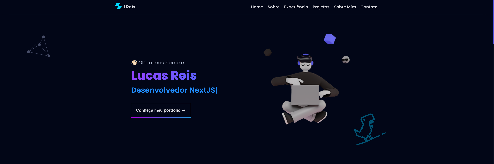

<h1 align="center">
  Portfolio 
</h1>

 

  
  
  

 

Resultado final do projeto 

 

## 📝 Descrição 

Meu portfólio criado com o objetivo de mostrar meus projetos. 

- Website: [lucasreis.vercel.app](https://lucasreis.vercel.app/)

## 🚀 Tecnologias

Esse projeto foi desenvolvido com as seguintes tecnologias:

- NextJS
- TypeScript
- Styled Components
- EmailJS
- Webhooks Discord API

## 📚 Bibliotecas

- [Google Fonts](https://fonts.google.com/)
- [React Icons](https://react-icons.github.io/react-icons/)
- [Phosphor Icons](https://phosphoricons.com/)

## 💻 Autor 
<table>
  <tr>
    <td align="center">
      <a href="https://github.com/LucasReisV1337">
         
        
          <b>Lucas Reis</b>
        
      </a>
    </td>
  </tr>
</table>

-----

  <h3 align="center"> Developed by <a href="https://www.linkedin.com/in/devlucasreis/">Lucas Reis</a> ☕</h3>
